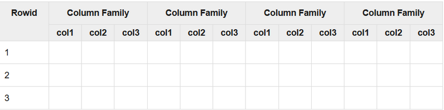

# Apache HBase

HBase is a data model that is designed to provide quick random access to huge amounts of structured data. It leverages the fault tolerance provided by the Hadoop File System (HDFS).

## Limitations of Hadoop

Hadoop can perform only batch processing, and data will be accessed only in a sequential manner. That means one has to search the entire dataset even for the simplest of jobs.

A huge dataset when processed results in another huge data set, which should also be processed sequentially. At this point, a new solution is needed to access any point of data in a single unit of time (random access).

## HBase 

- **column-oriented** database
- is a type of "NoSQL" database
- open-source
- distributed
- versioned

## Features

- HBase is linearly scalable.
- It has automatic failure support.
- It provides consistent read and writes.
- It integrates with Hadoop, both as a source and a destination.
- It has easy java API for client.
- It provides data replication across clusters.

## When HBase is used?

HBase isn’t suitable for every problem.

- It is used whenever there is a need to write heavy applications.
- HBase is used whenever we need to provide fast random access to available data.

Companies such as Facebook, Twitter, Yahoo, and Adobe use HBase internally.

## Storage Mechanism in HBase

- Table is a collection of rows.
- Row is a collection of column families.
- Column family is a collection of columns.
- Column is a collection of key value pairs.

Example schema of table in HBase:

